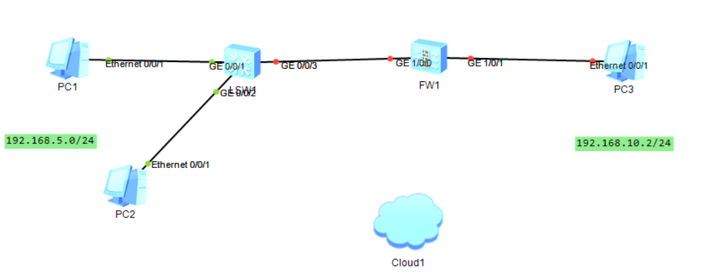

#### PC1的配置

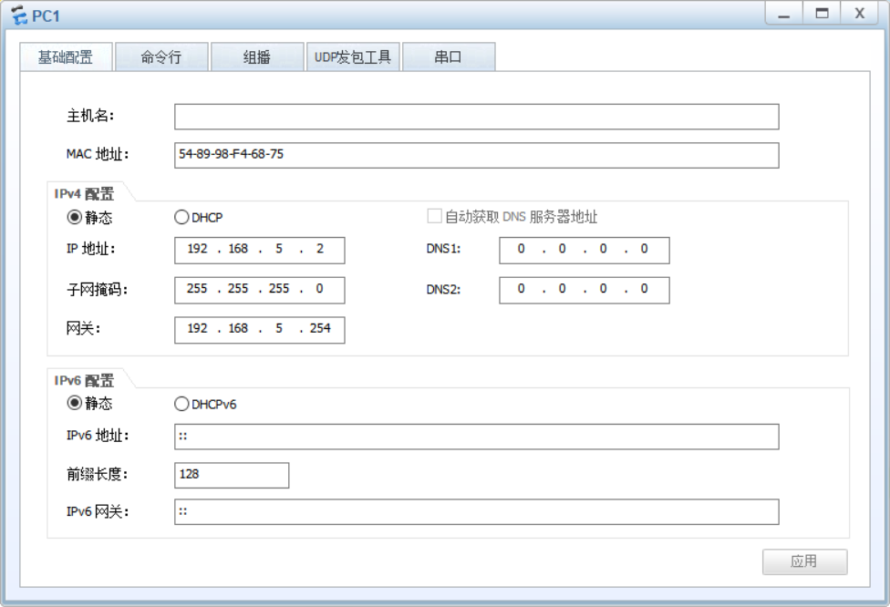

#### PC2的配置

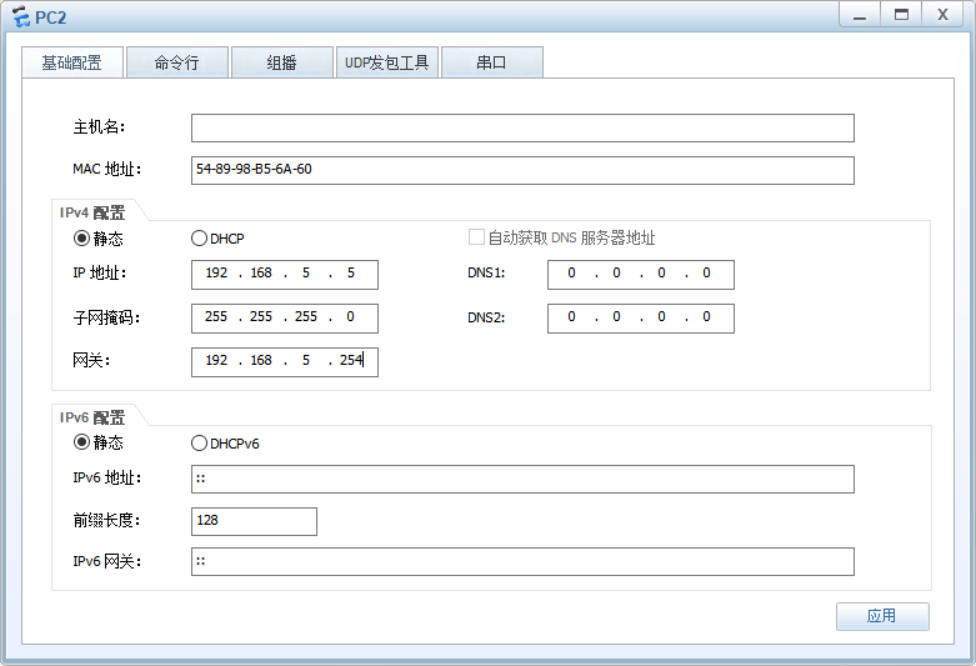

#### FW1配置

##### 配置地址转换池

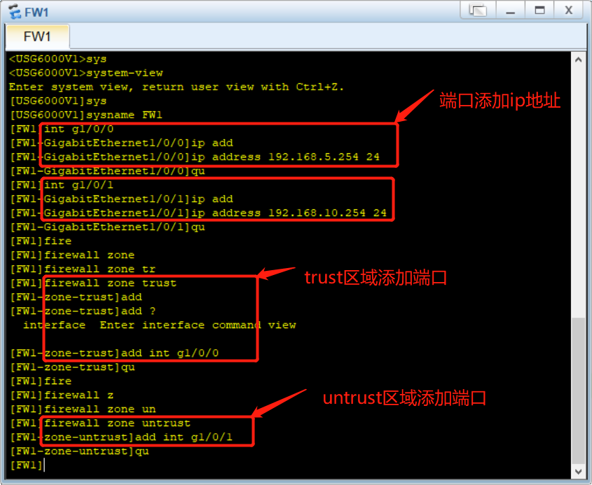

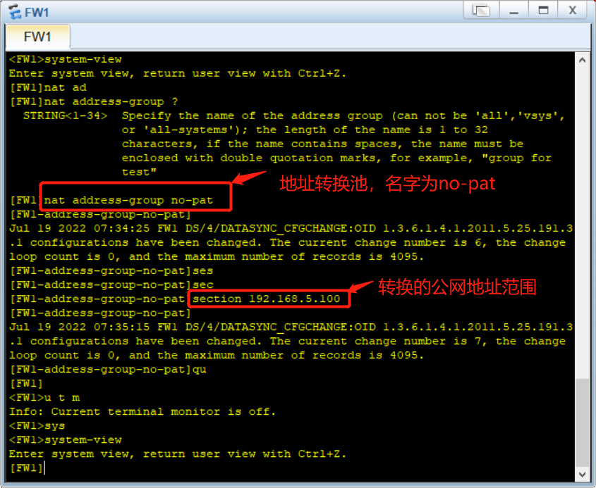

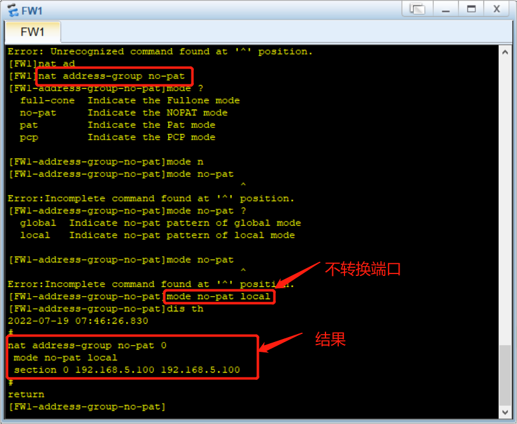

##### 配置NAT策略

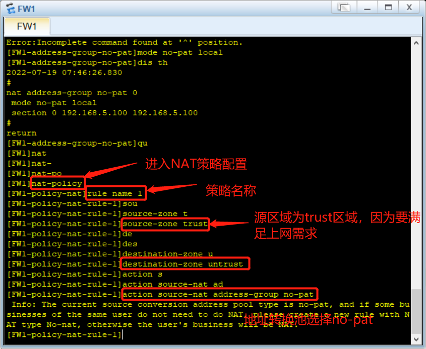

在这基础上会发现没办法ping通，所以需要配置安全策略

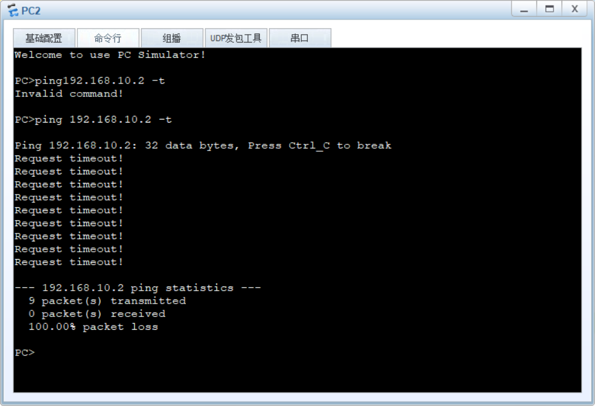

##### 设置安全策略

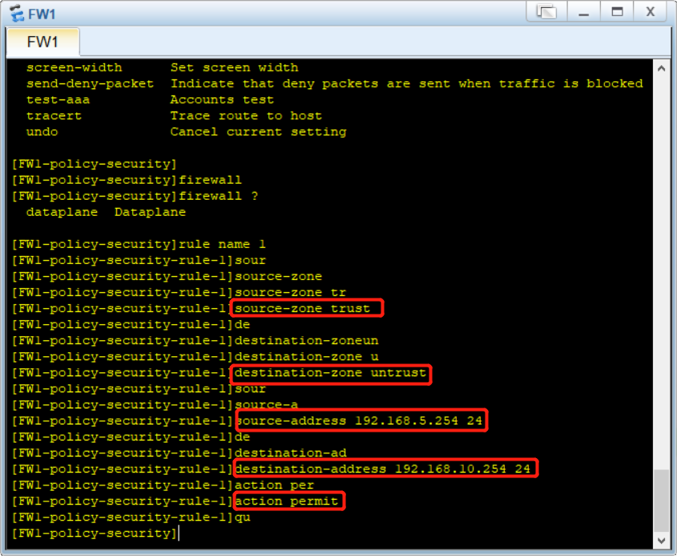

##### 结果

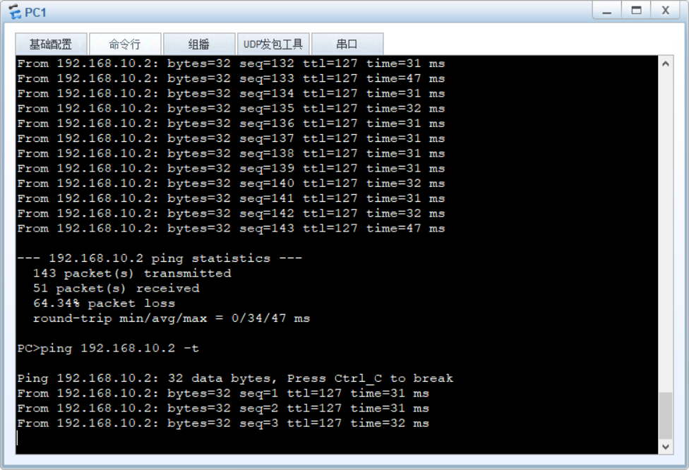

但是PC2无法同时ping通

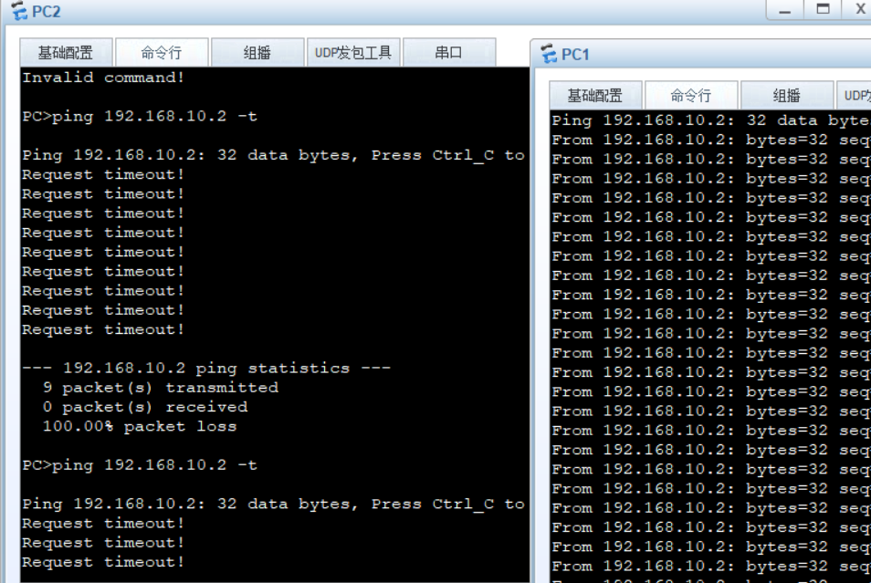

因为我们设置了地址转换但是端口转换关掉了，所以就会出现公网地址不够用的情况。

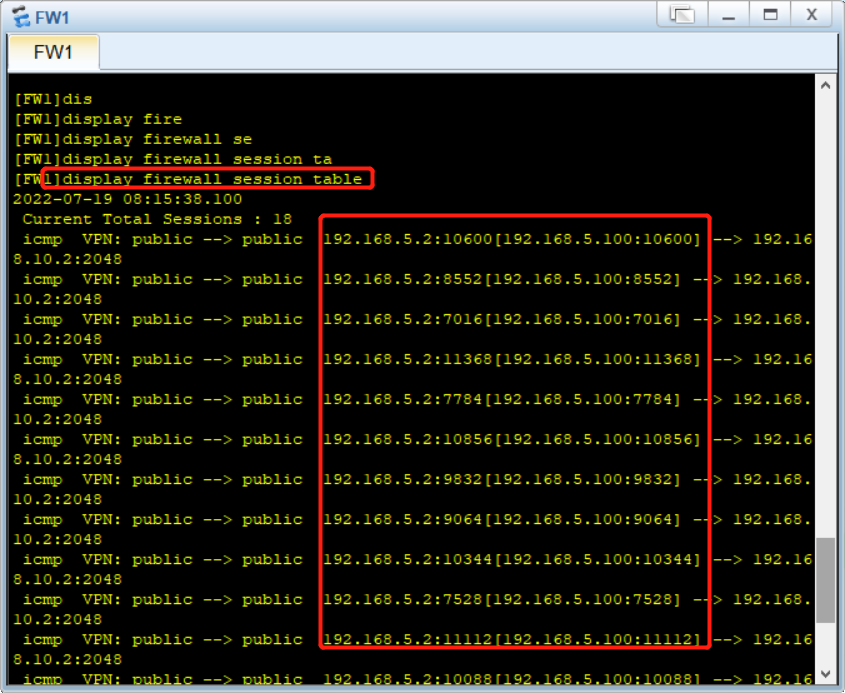

为了避免上述情况，我们可以开启端口转换

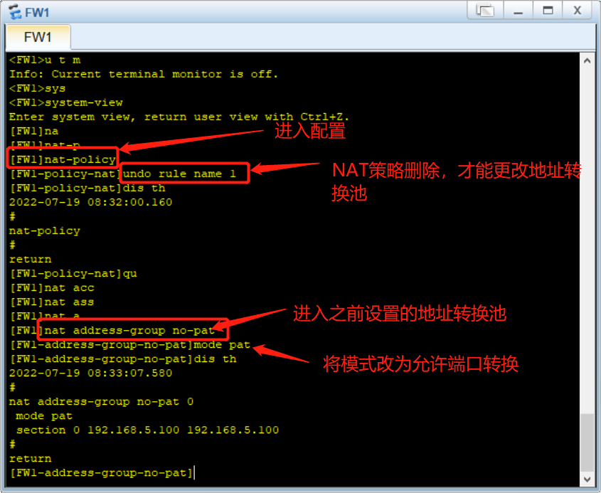

结果可以

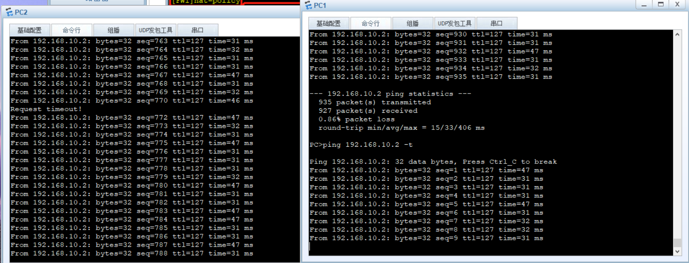

NAT的源地址转化一般有两种方式，一种是上述的地址池的地址，还有一种是出接口地址

##### 出接口地址

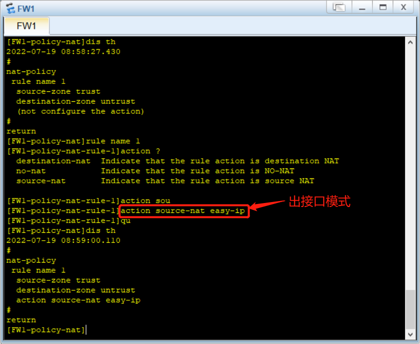

可以看见，转换的地址是出接口地址192.168.10.254，并且都可以ping通

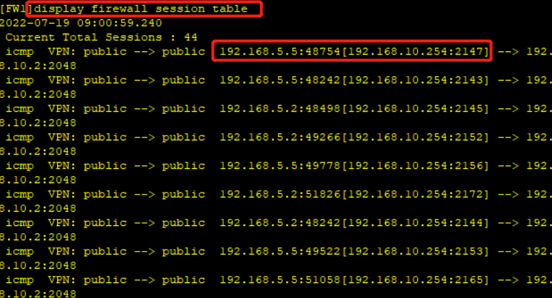